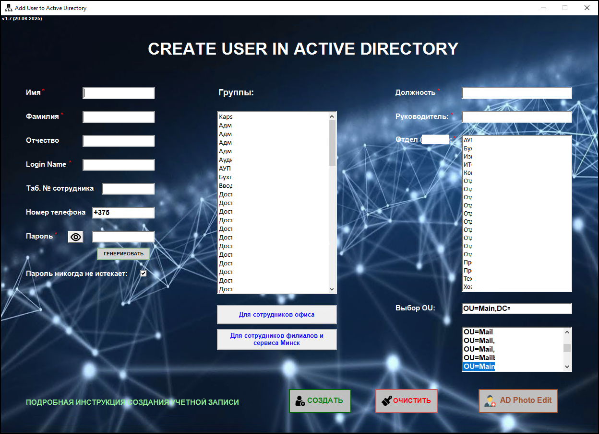

# Create-AD-User
Скрипт представляет собой полноценное GUI-приложение на PowerShell для создания пользователей в Active Directory с возможностью гибкой настройки параметров. 
Основные возможности: 
Создание пользователя в выбранном OU с заполнением всех ключевых атрибутов (имя, фамилия, логин, отчество, должность, компания, отдел, телефон, employeeID и др.). 
Генерация безопасного пароля по заданным требованиям (длина, спецсимволы, верхний/нижний регистр и цифры). 
Проверка обязательных полей формы, включая визуальное выделение незаполненных полей и подробные сообщения об ошибках. 
Автоматическое добавление в стандартные группы, выбранные пользователем из ListBox (с получением групп из заданного OU). 
Добавление в групповую AD-группу по названию отдела (поддерживается OU-зависимый поиск групп). 
Поиск и установка руководителя по отображаемому имени среди существующих пользователей Active Directory. 
Гибкое управление параметрами учётной записи, включая установку флага "Пароль не истекает". 
Логирование параметров создаваемого пользователя в консоль (Write-Host). 
Интуитивно понятный графический интерфейс на Windows Forms. 

## Скриншоты

###Главное окно:  

